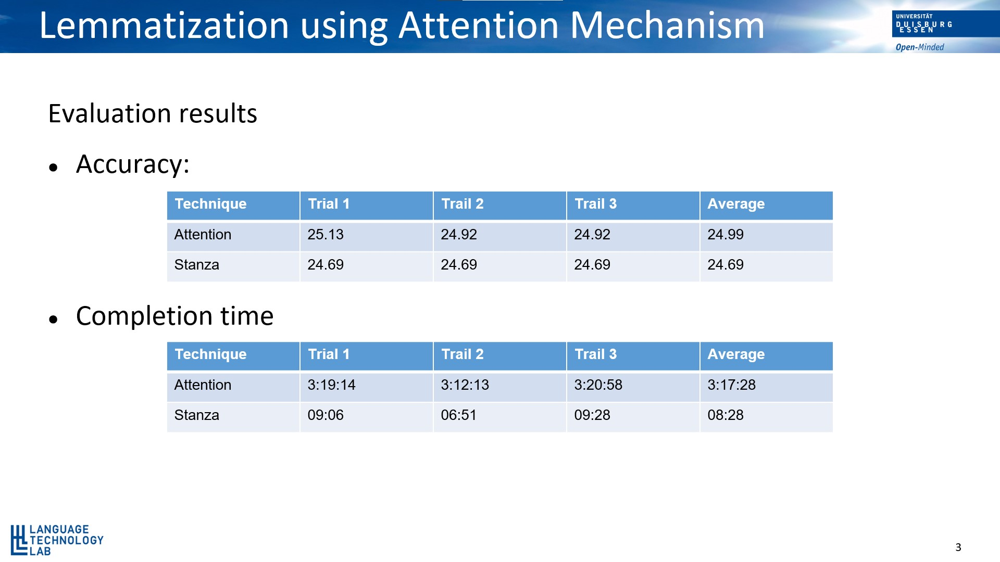

# Lemmatization using Attention Mechanism

Lemmatization is the process of determining what is the lemma (i.e., the dictionary form) of a given word. For example, the lemma of cars is car, and the lemma of replay is replay itself. This is a well-defined concept, but unlike stemming, requires a more elaborate analysis of the text input. Word inflection has a lot of regularities, which requires developing a set of rules for recovering the lemma of a word. But that can be surprisingly difficult because of some factors:
- Irregular forms. You’d have to treat them one by one.
- Words that look like they’re inflected, but are actually not. E.g., bring is not an inflected form of the unconceivable verb to bre.
- Inflected forms shared by different lemmas. E.g., in German, gehört can be a participle of hören (to hear) or of gehören (to belong), and only context can disambiguate.
- The number of inflection rules might be too high, or you may not have enough
knowledge of the language you’re working with.

The motivation of this project is to create lemmatized sentence of a sample, keeping the context of the sentence intact, by using the Attention mechanism.

## System requirements

Python >= 3.6
Nvidia GPU with more than 6GB memory

## Installation Guide

A complete installation guide can be found [here]()

## Dataset preparation

- Dataset: The dataset is about 3.5 million sentences and it is collected from [Leipzig Corpora](https://wortschatz.uni-leipzig.de/de/download/english). Due to hardware limitations, the dataset was trimmed down to 1.5 million sentences and considering only the sentences those have a minimum of 5 words and a maximum of 80 words.

- Lemmatization: The dataset created was lemmatized using StanfordNLP's Stanza library. The lemmatized sentences along with the original sentences were used to train the transformer model. The process of lemmatization can be found under ```training/lemmatization.ipynb```

## Training

A complete guide of how the model is trained can be found in ```training/Lemmatization using Attention.ipynb```

The specification of the computer used to train the model is as follows:

- Nvidia 1080Ti 11GB
- Xeon Processor
- 64GB Ram
- Ubuntu 18.04.4

## Preparation of test dataset

The test dataset for evaluation was taken from the COCA corpora. The process of making sentences and lemmatized sentences can be found under ```training/dataPreprocessing.ipynb```

## Pretrained model and evaluation

The evaluation results using the pretrained model is shown below. The evaluation process is just matching the target list of tokens of the original tokenized sentence with the predicted list of tokens from both Transformer model and the Stanza.



## Acknowledgement

[Piush Agarwal](https://www.ltl.uni-due.de/team/piush-aggarwal)